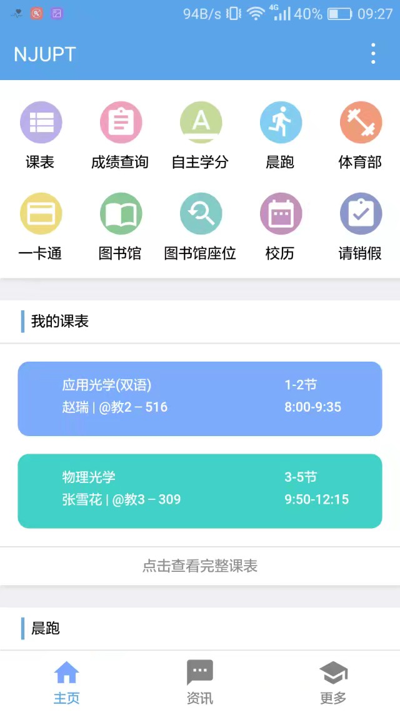
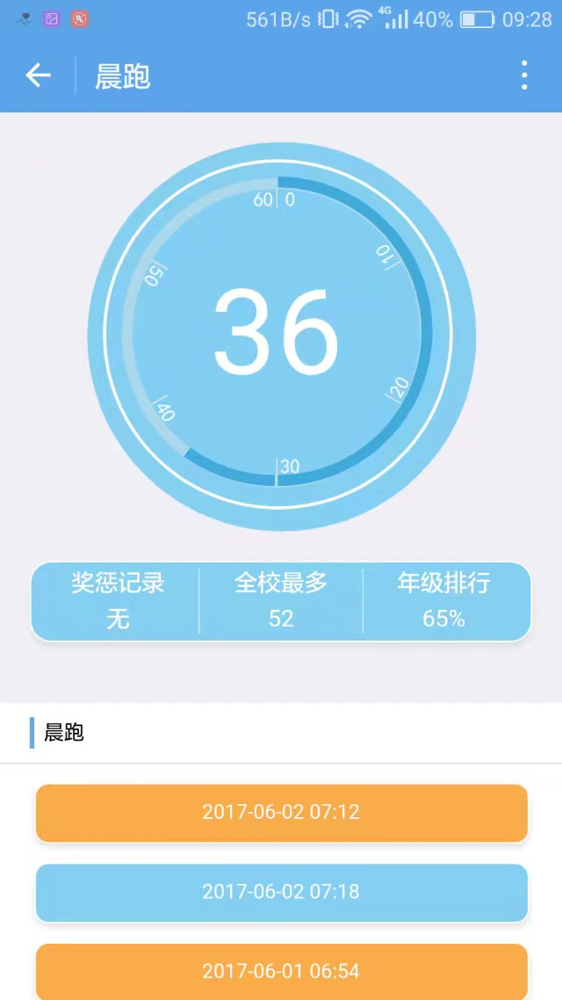
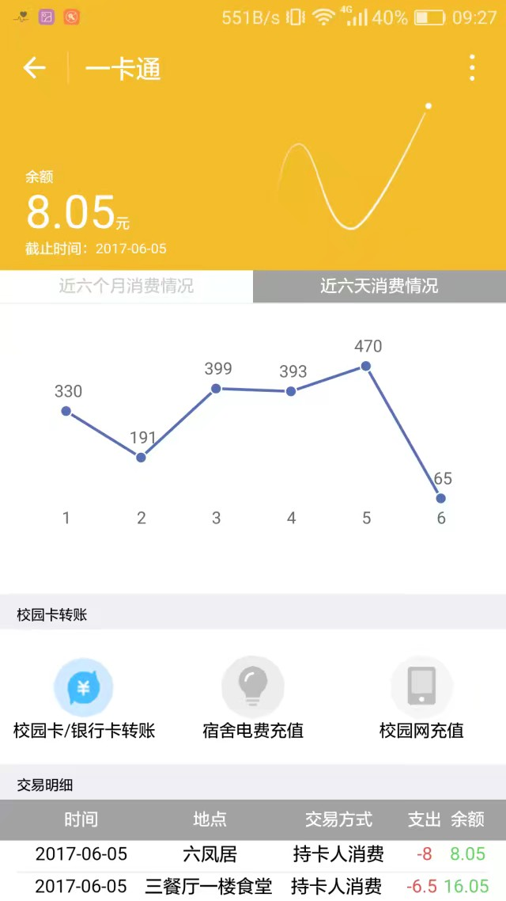
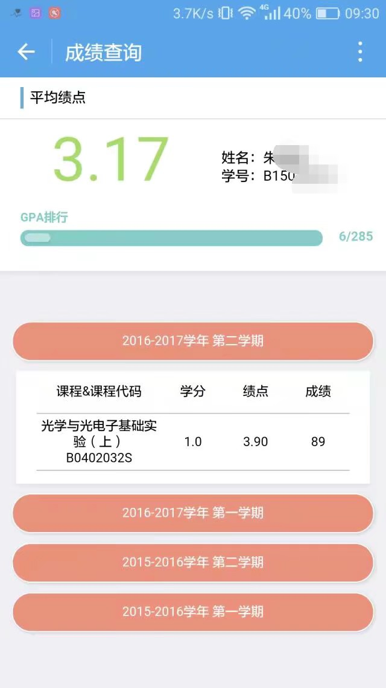

时间拉回到 2014 年，巴西世界杯在万众瞩目之下举办，但令人唏嘘的是，巴西队的表现不尽如人意，在家门口被德国队踢成了筛子。而在地球的另一边，顾姨在高考成绩出来之后填报了南京邮电大学，可是很不幸的被调剂到了生物医学工程专业。此时，狒狒神沉浸在高考失利的阴影中，并且选择再战一年，在复读前的闲暇时间他开始学习 C 语言。也是那一年，南京邮电大学的同学们只能通过正方教务系统查成绩，通过网页版跑操系统查晨跑，通过智慧校园系统查学费，通过图书馆系统查阅借阅书籍。虽然在前一年超级课程表获得市场极大的肯定，但是对于很多同学来说，在那个 16g 储存盛行的年代需要多下一个软件去查阅课表。

2014 年的夏天对朱晓峰、楚哥、唐子惠也是不平凡的，面临高二升高三的压力。作为艺术生唐子惠每天在画室画画，日复一日，希望年底的艺术统考能有一个好的结果。当时年级第二的朱晓峰在教室里紧张的复习着，梦想来年能考到心仪的学校。楚哥也在教室里痛苦并快乐的刷着试卷。

2015年充满了戏剧性，顾姨留任了南邮校科协网络部部长，并且一手创建了南京邮电大学官方微信，和帮主等同学做出了初代聚合校园信息的公众号，与此同时，学校里的另一个社团爱服务也搞了一个类似的东西，南京邮电大学的同学们在手机上就可以查阅一些自己的个人信息。两边的系统互相竞争，互相成长都在为了方便同学做出自己的努力。

2015年的狒狒神因为不够了解学校，调档到南京邮电大学，成功的被第一志愿地理信息科学专业录取。也是在那个暑假，爱水群的他在院新生群遇上了爱水群的顾姨，并且成功被捕获。也是在那个新生群，他认识了当时在阿里实习的奚佳伟学长，并且暗下决心四年之后也要去阿里巴巴工作。

2015年朱晓峰、楚哥、唐子惠相继被校科协散布在各个新生群的学长收纳，决心加入这个有趣的技术组织去寻找志同道合的人一起成长。

2016年是成长的一年，朱晓峰开始接替帮主维护官微的希望能实现更多的功能方便同学。小白入门前端开发的狒狒神还在苦苦挣扎学习技术，非常艰难的获得了在校科协留任的机会，但是和转专业失之交臂。信安专业的楚哥同时学习着技术与设计，希望写出酷酷的代码，做出精致的设计。唐子惠一如既往的画着自己喜欢的人物，但同时她也在探索新的技能，比如写代码。

2016年还是相遇的一年，高考完的彭泽凡、谭康威、宁鸿皓、邹昊、赵明睿、刘源也相继来到了南京邮电大学并且加入校科协。彭泽凡和邹昊在校科协网络部遇到了狒狒神，并且开始学习前端开发。宁鸿皓通过爱服务的老师认识了狒狒神，被狒狒神从计算部转移到了网络部。运营和设计能力出色的谭康威加入了科宣部，并且很早就成为了劳动力。赵明睿和刘源相依为命在计算部开始踏实的学习 Java。对未来充满期待的他们和前辈们一样因为热爱技术，追求创造，在校科协的一片沃土下，一天天成长。

2016年年底，狒狒神得到了第一次给学校干活的机会，和郑致远学长一起熬了几个通宵做完了体育部成绩管理系统。狒狒神赚到了程序员生涯的第一桶金，并且被赦免了未来所有的晨跑。与此同时，获得了体育部系统代码的管理权限。同年，南京邮电大学的同学们因为更好看的页面以及爱服务的学长们积极的运营，更多的使用着爱服务的信息查询系统。

2017年是革命性的一年，1 月份的时候微信提出了小程序的概念。正在大学生活动中心低效率准备期末考试的狒狒神被顾姨喊去调研一下智慧校园小程序的可行性。彼时，重庆邮电大学的"We 重邮"小程序已经上线。看到了重邮小程序的成功，狒狒神尝试写了个简单的 demo，发现智慧校园小程序是可行的，于是在当月 15 日拉了南邮智慧校园小程序的第一个讨论组"小程序啦啦啦"，这个讨论组也在同月 18 日升级成了群。

经过详细的总结和讨论，我们确定了需要做的几个功能：1. 课表查询；2. 成绩查询；3. 图书馆相关；4. 校内资讯；5. 跑操查询；6. 奥兰系统；7. 校历；8. 自主化学分查询。由于人力非常有限，在每个方向上几乎都只有一个人，因为有之前官微的经验，所以朱晓峰负责后端。狒狒神负责前端，楚哥负责设计，顾姨负责功能设计和进度把控。为了能够尽快赶上这个风口，我们把上线日期定在了 4 月份。

事与愿违的是，由于功能和页面太多，并且整个体系当时都处于探索阶段，所以到了约定好的 4 月份，只完成了一半的工作。不仅如此，由于通过和学校沟通，顾姨拿到了学校一卡通网站的接口，为了让第一版的小程序拥有绝对的竞争力，经过讨论，我们把一卡通功能也加入到了上线前的目标中。就这样，人力变成了制约发展的重要羁绊，于是狒狒神从校科协网络部找来了彭泽凡、邹昊加入前端开发，大一的他们能力上虽然有很多的不足，但是从整个项目来看着实提供了很多的帮助，顾姨从科宣部找来了李赫学长帮忙设计界面。

2017年5月份，在上线前，开始纠结产品的名字应该叫什么，想到的一些名字有：柚子驿站、邮子，甚至想到了一些英文名字。经过一番讨论之后，顾姨经过与学校沟通确定了"南京邮电大学"这个名字。

2017年6月12日晚上8点，在图书馆复习的狒狒神和在大学生活动中心的朱晓峰远程连线上线了"南京邮电大学"小程序第一版，随着宣布小程序上线，南邮小程序的访问量持续增加，才半个小时用户访问量就达到了 1.8 万，就这样，孱弱的学生机被南京邮电大学的同学们顶爆了，甚至连服务器后台都无法登录。但是，辛苦和努力总是有回报的，经过几天的努力之后，"南京邮电大学小程序"的稳定性得到了大大的提升，也逐渐成为了同学们生活中不可或缺的一部分。

以上就是《那些年的青柚工作室》上半部分，请大家期待《那些年的青柚工作室》下半部分。

